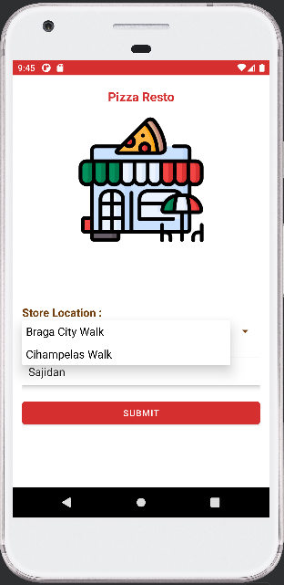
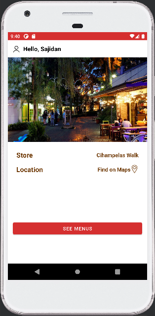
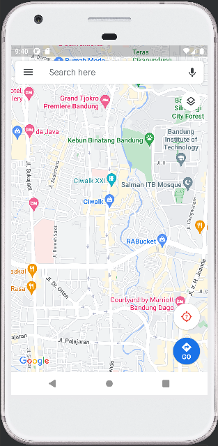
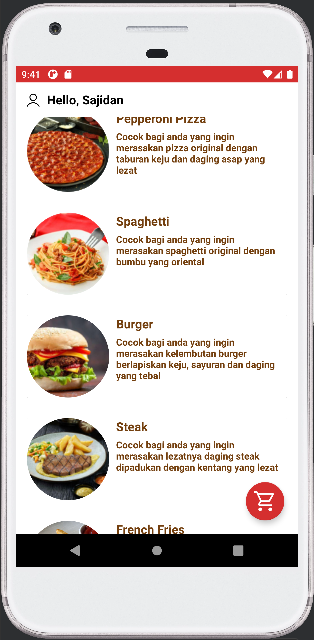
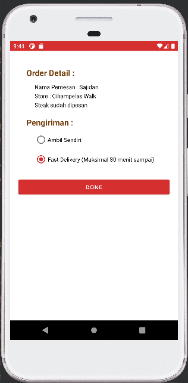
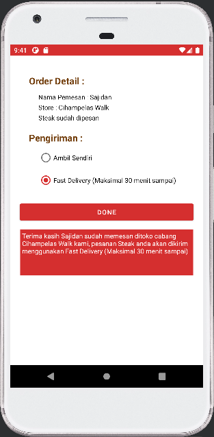

# Pizza-Restaurant-Apps
Tugas ini untuk melengkapi UAS Mata Kuliah Praktikum Pengembangan Aplikasi Mobile. <br/>

## Profile
Nama : Muhammad Firasy Sajidan Arifin <br/>
NIM : 1207050071 <br/>
Dosen Pengampu : Aldy Rialdy Atmadja, M.T

### Menambahkan API pada app Pizza Resto by : Sajidan
```markdown
[
{
"id": 1,
"price": "66000",
"number": "1",
"details": "Cocok bagi anda yang ingin merasakan pizza original dengan taburan keju dan daging asap yang lezat",
"foodName": "Pepperoni Pizza"
},
{
"id": 2,
"price": "50000",
"number": "2",
"details": "Cocok bagi anda yang ingin merasakan spaghetti original dengan bumbu yang oriental",
"foodName": "Spaghetti"
},
{
"id": 3,
"price": "35000",
"number": "3",
"details": "Cocok bagi anda yang ingin merasakan kelembutan burger berlapiskan keju, sayuran dan daging yang tebal",
"foodName": "Burger"
},
{
"id": 4,
"price": "100000",
"number": "4",
"details": "Cocok bagi anda yang ingin merasakan lezatnya daging steak dipadukan dengan kentang yang lezat",
"foodName": "Steak"
},
{
"id": 5,
"price": "20000",
"number": "5",
"details": "Cocok bagi anda yang ingin merasakan lezatnya kentang goreng",
"foodName": "French Fries"
},
{
"id": 6,
"price": null,
"number": "",
"details": null,
"foodName": null
}
]
```
#### Tampilan Home




### Tampilan Lokasi


### Tampilan Map


#### Tampilan Katalog


#### Tampilan Pesanan


